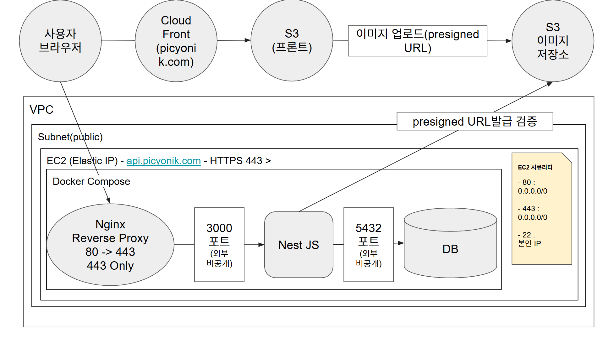
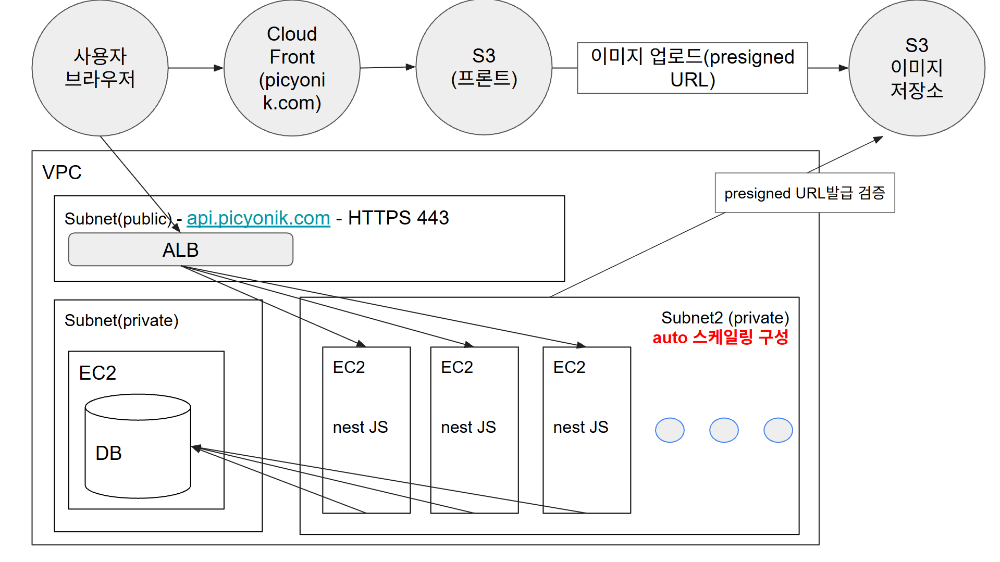

# AWS 배포 아키텍처

## 1. 초기 운영 구조: 단일 EC2 아키텍처

  

  <em>그림 1. 초기 트래픽을 고려한 단일 EC2 기반 저비용 운영 구조</em>

프론트엔드는 CloudFront와 S3를 통해 제공한다.

백엔드는 퍼블릭 서브넷의 단일 EC2에서 Docker Compose를 사용하여
Nginx, NestJS 및 PostgreSQL을 실행한다. Nginx는 HTTPS 요청을
NestJS의 3000번 포트로 전달하며, PostgreSQL의 5432번 포트는
외부에 공개하지 않는다.

사용자 브라우저는 NestJS에서 발급받은 Presigned URL을 사용하여
이미지를 S3 이미지 저장소에 직접 업로드한다.

이 구성은 비용과 운영 복잡도가 낮지만, EC2 장애가 발생하면
API와 데이터베이스가 함께 중단되는 단일 장애점이 존재한다.

---

## 2. 확장 운영 구조: ALB 및 Auto Scaling 아키텍처

  

  <em>그림 2. 트래픽 증가에 대응하기 위한 ALB 및 EC2 Auto Scaling 기반 확장 구조</em>

인터넷에서 들어오는 HTTPS 요청은 Application Load Balancer를
통해 정상 상태의 NestJS EC2 인스턴스로 분산된다.

NestJS 인스턴스는 Auto Scaling Group에서 관리되며 트래픽과
서버 상태에 따라 자동으로 생성되거나 종료된다. PostgreSQL은
별도의 EC2로 분리하고 모든 NestJS 인스턴스가 동일한 데이터베이스를
사용한다.

NestJS를 두 대 이상 운영할 경우 Socket.IO 이벤트와 게임 상태를
서버 간에 공유하기 위해 Redis Adapter 및 분산 상태 관리 구성이
추가로 필요하다.

이 구성은 확장성과 장애 대응 능력이 높지만 ALB, EC2, NAT Gateway,
Redis 등의 추가 비용과 운영 복잡도가 발생한다.